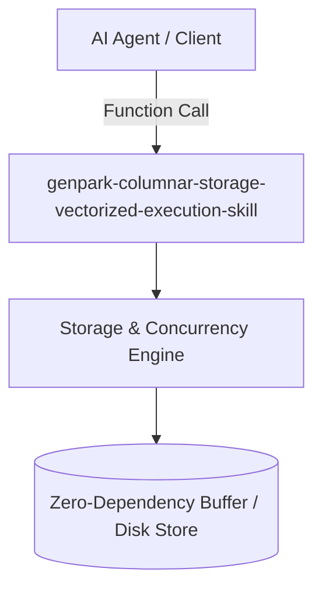

# genpark-columnar-storage-vectorized-execution-skill

[](https://github.com/alphaparkinc/genpark-columnar-storage-vectorized-execution-skill/actions)
[](https://opensource.org/licenses/MIT)
[](https://www.python.org/downloads/)

> Columnar storage engine supporting Run-Length Encoding (RLE), column-wise chunking, vectorized filter bitmasks, and SIMD-like aggregation kernels.

## Architecture



## Features
- Pure standard library Python implementation with strictly zero pip dependencies.
- Production-grade algorithms with rigorous type safety and clear abstraction boundaries.
- Native Model Context Protocol (MCP) server integration for seamless AI agent orchestration.

## Installation

```bash
git clone https://github.com/alphaparkinc/genpark-columnar-storage-vectorized-execution-skill.git
cd genpark-columnar-storage-vectorized-execution-skill
```

## Quickstart

```bash
python example_usage.py
```
